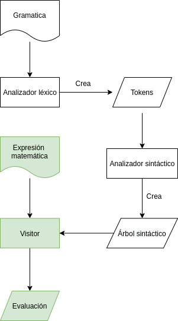
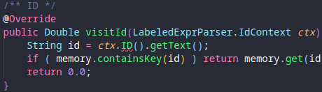
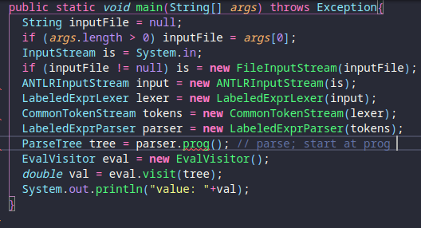

# antlr4_scientific_calculator
## Cómo está articulado el traductor:


Como se ve en el diagrama de arriba, el traductor se compone por dos tipos de analizadores. El primero es un analizador léxico que toma una gramática como entrada y a partir de esta gramática el analizador léxico crea los tokens. Después, estos mismos tokens los usa el analizador sintáctico para construir un árbol sintáctico. Con este árbol se puede asignar los tokens a los caracteres que le mandemos de entrada al analizador. 

### Visitor


 Para poder hacer una calculadora a partir de los dos analizadores que tenemos, es necesario poder tomar alguna acción según el lema, o el valor del token. Para hacer esto usamos un patrón de diseño llamado visitor. Como se ve en el siguiente diagrama, este patrón toma varios elementos, y el visitor es el encargado de implementar las funcionalidades de los elementos.

Para la calculadora, el visitor se encargará de implementar métodos para los tokens que elegimos con un # en nuestra gramática. Un ejemplo de la implementación se muestra enseguida:



En la calculadora, el visitor será usado para evaluar cadenas de texto generadas por un interfaz gráfica de una calculadora. 

## clases usadas


En nuestra calculadora estamos usando nuestra implementación del visitor para ejecutar todas nuestras las instrucciones que definimos en la gramática LabeledExpr. El diagrama UML muestra todas las dependencias usadas para la calculadora. En este diagrama, se toma un analizador léxico, LabeledExprLexer, para producir los tokens que usará el analizador sintáctico llamado LabeledExprParser. Al final se produce ParseTree que es nuestro árbol sintáctico, este se usará por nuestra clase del tipo visitor llamada EvalVisitor. Es esta última clase que podemos usar en nuestra calculadora, y se implementa de la siguiente manera:




## instrucciones para compilar y correr:

```antlr4 -no-listener -visitor LabeledExpr.g4```

```javac Calculator*.java LabeledExpr*.java```

```java CalculatorGUI```
